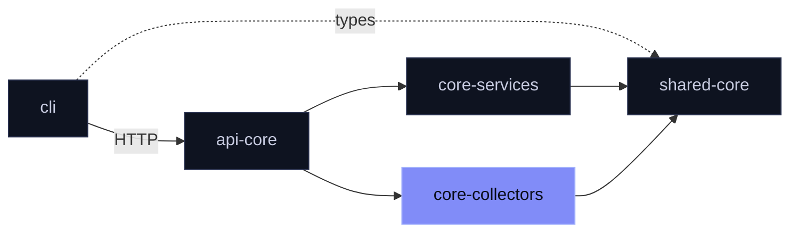

<div align="center">

# `@mira/core-collectors`

**Three sources. One shape.**

Reddit · Hacker News · RSS → `CollectedItem[]`

[](https://www.npmjs.com/package/@mira/core-collectors)
[](./LICENSE)

</div>

<br>

Fetches discussion from where your market talks and normalises it into the `CollectedItem` shape from `@mira/shared-core`, so everything downstream treats every source the same.

## Install

```sh
npm install @mira/core-collectors
```

## Sources

| | Function | Backed by | Credentials |
|:--|:--|:--|:--|
| **Reddit** | `collectReddit` | Apify actor (paid) | `APIFY_API_TOKEN` |
| **Hacker News** | `collectHackerNews` | Algolia HN search | none |
| **RSS** | `collectNewsRSS` | Your feeds | none · `JINA_API_KEY` optional for full text |

```ts
import { collectReddit, collectHackerNews, collectNewsRSS } from '@mira/core-collectors'

const [reddit, hn, rss] = await Promise.allSettled([
  collectReddit({ subreddits: ['SaaS', 'startups'], query: 'invoicing', depth: 'quick' }),
  collectHackerNews({ query: 'invoicing software' }),
  collectNewsRSS({ feeds: ['https://techcrunch.com/feed/'], query: 'invoicing' }),
])
```

## Built to behave

- **Capped spend.** Reddit billed results are limited per depth, and a caller budget can only lower the cap. `planRedditRun` previews the limits without a call.
- **One paid run.** All subreddits go into a single actor run. An empty list makes no call at all.
- **Relaxes only when needed.** Hacker News drops trailing query words only when the full query finds nothing.
- **Precise first.** RSS matching returns exact matches when there are any, loose ones otherwise.
- **Accounted.** Apify calls and billed results are recorded into the shared usage scope.

## When things go wrong

| Function | On failure |
|:--|:--|
| `collectReddit` | Throws — missing token, network, HTTP or shape errors |
| `collectHackerNews` | Throws — non-2xx, network or validation errors |
| `collectNewsRSS` | Skips the bad feed and carries on |
| `requestApifyActor` | Never throws — returns `Result<unknown[], ApifyError>` |

> [!TIP]
> Fanning out with `Promise.allSettled`? Surface the rejections — don't discard them.

## Where it sits



<details>
<summary><b>Configuration</b></summary>

<br>

| Variable | For |
|:--|:--|
| `APIFY_API_TOKEN` | Reddit and `requestApifyActor` |
| `MIA_ENABLE_FULLTEXT=true` | RSS full text through Jina Reader, exact matches only |
| `JINA_API_KEY` | Optional key for Jina Reader |

The collector reads `MIA_ENABLE_FULLTEXT`; the standalone API reads `MIRA_ENABLE_FULLTEXT`. Set each as spelled.

</details>

<details>
<summary><b>Build from source</b></summary>

<br>

Clone next to `shared` in a pnpm workspace, then:

```sh
pnpm install && pnpm build
```

</details>

<br>

<div align="center">
<sub>
Part of <a href="https://github.com/mira-js">Mira's open core</a> ·
<a href="./LICENSE">AGPL-3.0-only</a> ·
<a href="https://github.com/mira-js/.github/blob/main/CONTRIBUTING.md">Contributing</a> (<a href="https://github.com/mira-js/.github/blob/main/CLA.md">CLA</a>) ·
<a href="https://github.com/mira-js/core-collectors/security/advisories/new">Report a vulnerability</a>
<br>
Copyright (C) 2026 Fernando Nieto Pallares
</sub>
</div>
